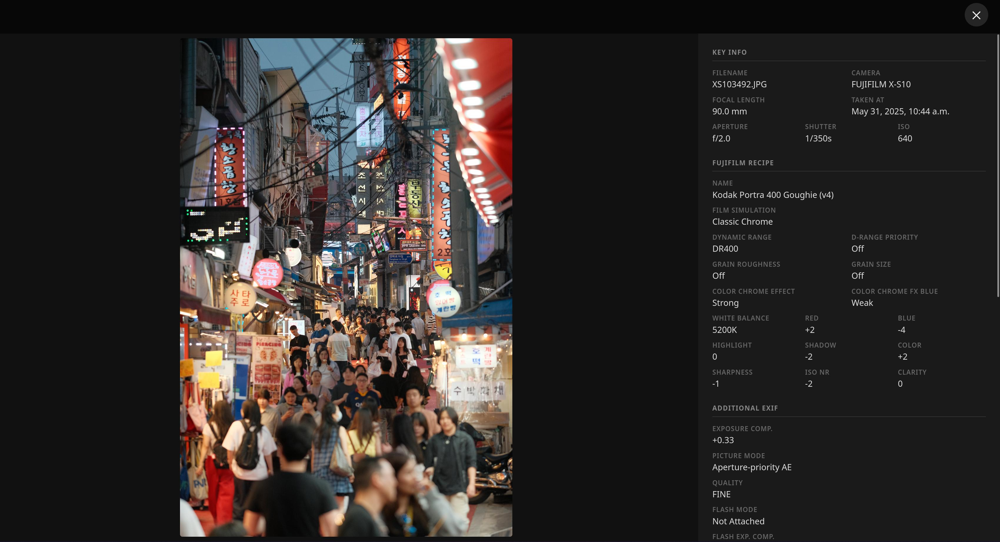
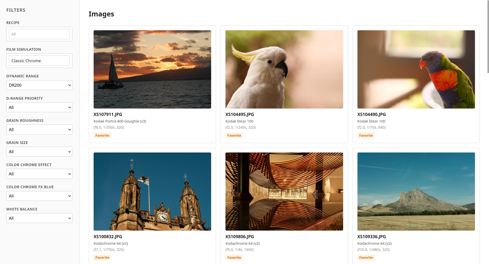

# Film Simulations Reader

A Django application for managing Fujifilm camera recipes and browsing your image catalog. It reads EXIF data from your JPEG files, matches images to the Fujifilm recipe they were shot with, and lets you filter and group your catalog by recipe. Camera integration (pushing recipes directly to the camera) is in progress.




---

## Installation

### Pre-requirements

#### Python & pip

Python 3.11+ is required.

- **macOS:** `brew install python`
- **Ubuntu:** `sudo apt install python3 python3-pip python3-venv`

#### libusb (for camera USB communication)

- **macOS:** `brew install libusb`
- **Ubuntu:** `sudo apt install libusb-1.0-0`

#### PostgreSQL

- **macOS:**
  ```bash
  brew install postgresql@16
  brew services start postgresql@16
  ```
  Then create the database and user:
  ```bash
  psql postgres
  ```
  ```sql
  CREATE USER fujifilm_recipes WITH PASSWORD 'fujifilm_recipes';
  CREATE DATABASE fujifilm_recipes OWNER fujifilm_recipes;
  \q
  ```

- **Ubuntu:**
  ```bash
  sudo apt install postgresql postgresql-contrib
  sudo systemctl start postgresql
  sudo -u postgres psql
  ```
  ```sql
  CREATE USER fujifilm_recipes WITH PASSWORD 'fujifilm_recipes';
  CREATE DATABASE fujifilm_recipes OWNER fujifilm_recipes;
  \q
  ```

#### Memcached

- **macOS:** `brew install memcached && brew services start memcached`
- **Ubuntu:** `sudo apt install memcached && sudo systemctl start memcached`

#### RabbitMQ (only required for async image processing with Celery)

- **macOS:** `brew install rabbitmq && brew services start rabbitmq`
- **Ubuntu:** `sudo apt install rabbitmq-server && sudo systemctl start rabbitmq-server`

---

### Project setup

1. **Clone the repository:**
   ```bash
   git clone <repo-url>
   cd film_simulations_reader
   ```

2. **Create and activate a virtual environment** (using `virtualenvwrapper`):
   ```bash
   mkvirtualenv film_simulations_reader
   workon film_simulations_reader
   ```
   Or with plain `venv`:
   ```bash
   python -m venv .venv
   source .venv/bin/activate
   ```

3. **Install dependencies:**
   ```bash
   pip install -r requirements.txt
   ```

4. **Configure the database** in `src/config/settings.py` if your PostgreSQL credentials differ from the defaults (`fujifilm_recipes` / `fujifilm_recipes`).

5. **Apply migrations:**
   ```bash
   python manage.py migrate
   ```

---

## Processing your image catalog

Before using the web interface, you need to process your images so their EXIF data and recipe information are stored in the database. Point `IMAGE_DIR` at the root of your image folder.

### Async (recommended — requires Celery + RabbitMQ)

This is faster as images are processed in parallel by Celery workers.

Start a Celery worker in a separate terminal:
```bash
celery -A src.config worker --loglevel=info --concurrency=8
```
You can change the number of simultaneous adjusting the concurrency.

Then enqueue all images for processing:
```bash
python manage.py process_images --image-dir /path/to/your/images
```

### Sync (slower, no Celery required)

Images are processed one by one in the foreground:
```bash
python manage.py process_images_sync --image-dir /path/to/your/images
```

Use this if you don't want to set up RabbitMQ and Celery.

---

## How to run

Start the Django development server:
```bash
python manage.py runserver
```

Then open [http://localhost:8000/images/](http://localhost:8000/images/) in your browser to browse your image gallery. You can filter and group images by recipe, film simulation, and other settings.

---

## Developer setup

Install the development dependencies:
```bash
pip install -r requirements-dev.txt
```

### Running the tests

```bash
pytest
```

Tests use `pytest-django`. Configuration is in `pytest.ini`.

---

## How to use

### Browse your catalog

Visit `/images/` to see all processed images. Use the filter controls to narrow results by recipe, film simulation, white balance, and more.

### Process new images

Re-run `process_images` or `process_images_sync` pointing at any directory containing new images. Already-processed images are updated in place with fresh EXIF data. Images without Fujifilm EXIF data are skipped.

### Generate thumbnails

```bash
python manage.py generate_thumbnails
```

### Camera integration (TODO)

Pushing recipes directly to the camera via PTP/USB is under development. See [ADR/001-camera-bridge.md](ADR/001-camera-bridge.md) for the architectural decisions behind the camera bridge implementation.
