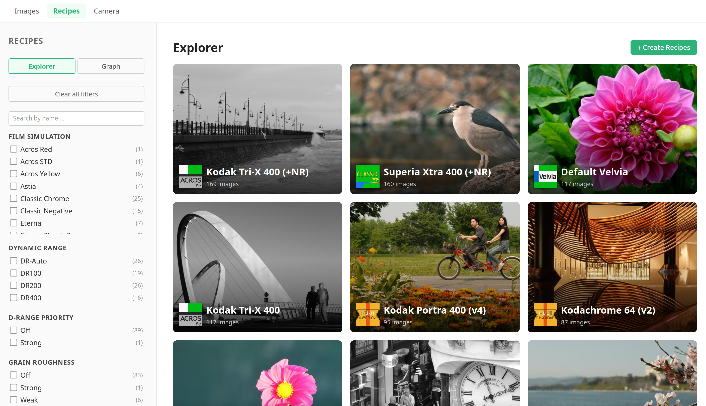
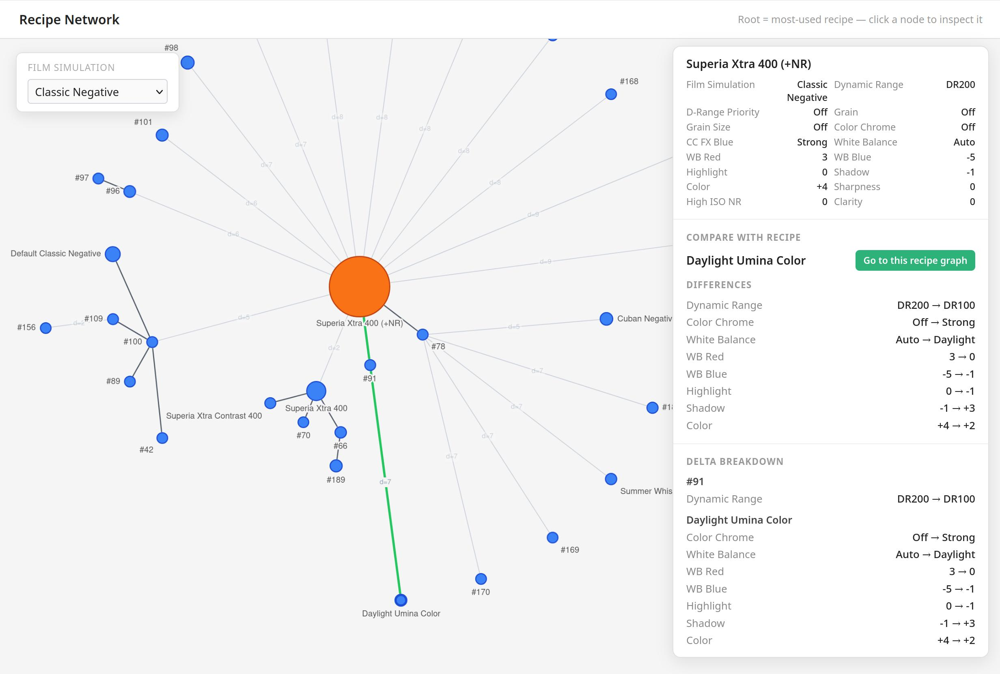
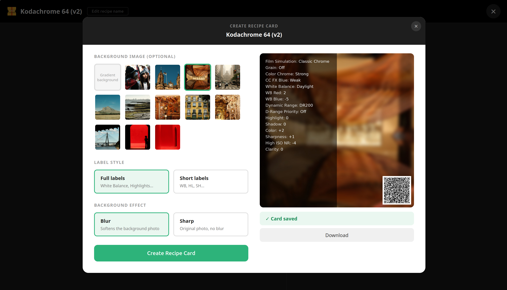
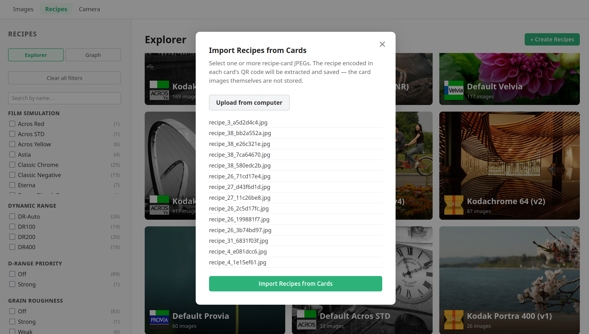

# Film Simulations Manager

A Django application for managing Fujifilm camera recipes and browsing your image catalog. It reads EXIF data from your JPEG files, matches images to the Fujifilm recipe they were shot with, and lets you filter and group your catalog by recipe. You can push recipes directly to your camera over USB and explore relationships between recipes through an interactive graph.

Read more about it in our [documentation index](docs/index.md).





## Features

- Import Fujifilm JPEGs to **build your image catalog and recipe collection**, then browse them in a filterable gallery
- **Push your recipes to your camera**'s custom slots over USB
- Browse and search your recipe collection with faceted filtering by film simulation, dynamic range, grain, and more
- **Generate shareable recipe cards** so other Fujifilm shooters can import your recipes
- **Import recipes** from a Fujifilm JPEG or a shared recipe card (QR code)
- **Explore relationships between recipes** through an interactive graph, compare differences side by side, and trace how your recipes evolved from one another
- View full-resolution images with their complete recipe and EXIF data
- Rate images (0–5 stars) individually or in bulk from the command line
- Sort the gallery by rating to surface your best shots first
- Customize the cover image shown for each recipe

---





## Installation

Two installation modes are available depending on your needs:

|                            | Lite (user-only)              | Full (developer)               |
| -------------------------- | ----------------------------- | ------------------------------ |
| **Database**               | SQLite (file, no server)      | PostgreSQL                     |
| **Broker / worker**        | None                          | RabbitMQ + Celery              |
| **Image processing**       | Sequential (one at a time)    | Parallel (N workers)           |
| **OS services to install** | None                          | PostgreSQL, RabbitMQ           |
| **Best for**               | Personal use, small libraries | Development, large collections |

### Lite install (recommended for personal use)

No database server or message broker required.

**Clone and install system dependencies:**

```bash
git clone <repo-url>
cd film_simulations_reader
./setup.sh lite   # installs Python, libusb, exiftool (macOS and Ubuntu)
```

**Set up the project:**

```bash
make setup-lite   # creates venv, installs deps, generates SQLite config, runs migrations
make run          # start the development server
make update       # pull latest changes, install new deps, run migrations
```

Images are processed sequentially when you run `python manage.py process_images`. No
background worker is needed.

---

### Full install (for development and large collections)

Parallel image processing via Celery. Requires PostgreSQL and RabbitMQ.

**Install system dependencies:**

```bash
./setup.sh full   # installs Python, libusb, exiftool, PostgreSQL, RabbitMQ (macOS and Ubuntu)
```

This script is idempotent — re-running it skips anything already in place.

**Set up the project:**

```bash
make setup-full   # creates venv, installs deps, generates PostgreSQL config, runs migrations
```

**Start the server and worker:**

```bash
make run      # start the Django development server
make worker   # start a Celery worker for parallel image processing
```

---

## Updating

To pull the latest changes, install any new dependencies, and apply pending migrations in one step:

```bash
make update
```

---

### Manual setup

Follow the steps below if you prefer to install dependencies individually.

#### Python & pip

Python 3.11+ is required.

- **macOS:** `brew install python`
- **Ubuntu:** `sudo apt install python3 python3-pip python3-venv`

#### libusb (for camera USB communication)

- **macOS:** `brew install libusb`
- **Ubuntu:** `sudo apt install libusb-1.0-0`

#### PostgreSQL (full install only)

- **macOS:**

  ```bash
  brew install postgresql@16
  brew services start postgresql@16
  ```

  Then create the database and user:

  ```bash
  psql postgres
  ```

  ```sql
  CREATE USER fujifilm_recipes WITH PASSWORD 'fujifilm_recipes';
  CREATE DATABASE fujifilm_recipes OWNER fujifilm_recipes;
  \q
  ```

- **Ubuntu:**
  ```bash
  sudo apt install postgresql postgresql-contrib
  sudo systemctl start postgresql
  sudo -u postgres psql
  ```
  ```sql
  CREATE USER fujifilm_recipes WITH PASSWORD 'fujifilm_recipes';
  CREATE DATABASE fujifilm_recipes OWNER fujifilm_recipes;
  \q
  ```

#### exiftool (required for image processing with `process_images`)

- **macOS:** `brew install exiftool`
- **Ubuntu:** `sudo apt install libimage-exiftool-perl`

#### RabbitMQ (full install only)

- **macOS:** `brew install rabbitmq && brew services start rabbitmq`
- **Ubuntu:** `sudo apt install rabbitmq-server && sudo systemctl start rabbitmq-server`

---

### Project setup (manual)

1. **Clone the repository:**

   ```bash
   git clone <repo-url>
   cd film_simulations_reader
   ```

2. **Create and activate a virtual environment:**

   ```bash
   python -m venv .venv
   source .venv/bin/activate
   ```

3. **Install dependencies:**

   ```bash
   pip install -r requirements.txt
   ```

4. **Generate the settings file** — choose one:

   ```bash
   make env       # full stack defaults (PostgreSQL, Celery)
   make env-lite  # SQLite, sequential processing
   ```

5. **Apply migrations:**
   ```bash
   python manage.py migrate
   ```

---

## Processing your image catalog

Before using the web interface, you need to process your images so their EXIF data and recipe information are stored in the database.

```bash
python manage.py process_images /path/to/your/images
```

The command behaves according to your install mode:

- **Lite install** (`USE_ASYNC_TASKS=False`): images are processed one at a time in the foreground. The terminal blocks until all images are done.
- **Full install** (`USE_ASYNC_TASKS=True`): one Celery task is enqueued per image and processed in parallel by the worker. Start the worker first:

  ```bash
  make worker   # or: celery -A src.config worker --loglevel=info --concurrency=8
  ```

---

## How to run

Start the Django development server:

```bash
python manage.py runserver
```

Then open [http://localhost:8000/images/](http://localhost:8000/images/) in your browser to browse your image gallery. You can filter and group images by recipe, film simulation, and other settings.

---

## How to use

### Browse your catalog

Visit `/images/` to see all processed images. Use the filter controls to narrow results by recipe, film simulation, white balance, and more.

### Process new images

Re-run `process_images` pointing at any directory containing new images. Already-processed images are updated in place with fresh EXIF data. Images without Fujifilm EXIF data are skipped.

### Rate images

Open any image in the detail view and click a star to assign a rating (0–`IMAGE_MAX_RATING`,
default 5). Use the ✕ button to clear it back to 0. Enable **Rating first** in the gallery
sidebar to sort by rating descending.

To rate a whole folder at once from the command line:

```bash
python manage.py rate_images /path/to/folder --rating=3
```

### Push a recipe to your camera

Connect your Fujifilm camera in PTP mode, then open any image in the detail view. Name its
recipe if it doesn't have one yet, and use the "Send to camera" button to write it to one
of the custom slots (C1–C7).

For full information on available functionality, see [docs/web_interface.md](docs/web_interface.md) and [docs/management_commands.md](docs/management_commands.md).

---

## Camera compatibility

The only model this project has been tested on is the **Fujifilm X-S10**. Based on analysis of the PTP property codes used (custom slot registers `0xD18C`–`0xD1A5`), any **X-Trans IV** camera (X-T3, X-T4, X-T30, X-T30 II, X-S10, X100V, X-Pro3, X-E4, X-H1) should work, and **X-Trans V** models (X-T5, X-T50, X-H2, X-H2S, X100VI, X-E5, X-M5) are likely compatible too. Earlier generations (X-Trans III and below) do not implement the custom slot registers and will not work.

If you test on a model not listed here, please open an issue to report the result.

---

## Safety and disclaimer

We have observed experimentally that the camera firmware rejects invalid PTP property values — the X-S10 will not accept out-of-range or malformed writes, so mis-configured recipes should not be applied. That said, **this software is provided as-is, with no warranty of any kind**. We are not responsible for any damage, data loss, or malfunction caused to any camera or device by using this software. Use it at your own risk.

---

## License

This project is licensed under the [GNU General Public License v3.0](LICENSE).

---

## Development

Pull requests are welcome. See [docs/contributing.md](docs/contributing.md) for the full guide: local environment setup, testing strategy, PR requirements, and review conventions.
