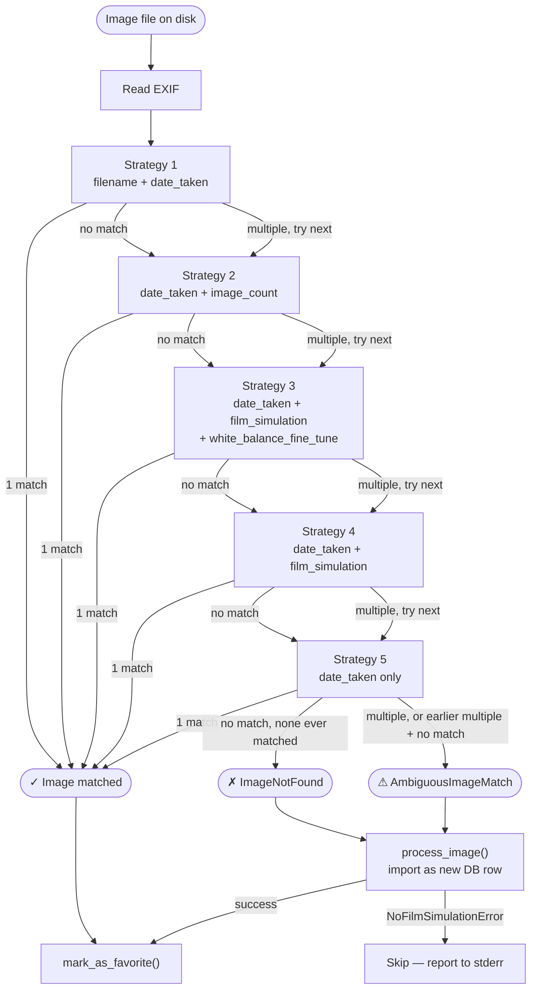

# Favorite Image Matching

## The `mark_favorites` command

`mark_favorites` takes a folder of images and marks the corresponding records in the
database as favourites. The intended workflow is: a user curates a collection of their
best shots in an external app (e.g. Apple Photos), exports that selection to a folder,
then runs the command to reflect those favourites in the database.

```
python manage.py mark_favorites <folder>
```

## The matching problem

The files in the export folder are rarely identical copies of the originals that were
ingested into the database. Export tools commonly rename files:

- Apple Photos UUID exports: `06564B18-30FB-4560-A3F1-51BD58F0EBAB.jpg`
- Photos.app duplicate suffixes: `IMG_1234~2.JPG`
- Manual copies: `IMG_1234 Copy.JPG`

Furthermore, camera filenames reset with each memory card format, so a given filename
will often appear multiple times across a large catalogue. **Filename alone is not a
reliable identifier.**

## Solution: Cascading Lookup Strategies

The domain function `find_image_for_path` reads the EXIF metadata from the file on disk and
tries a series of lookup strategies in order of specificity. The first strategy that returns
exactly one match wins. If a strategy matches multiple rows it is skipped and the next
strategy is tried — a later, different combination of fields may still narrow it down to a
unique record. `AmbiguousImageMatch` is raised only once all strategies have been exhausted
and at least one of them found multiple candidates. If no strategy found anything at all,
`ImageNotFound` is raised.

### Strategies (in order)

| # | Strategy | Fields used | Why it can fail |
|---|---|---|---|
| 1 | `_by_filename_and_date` | `filename` + `date_taken` | File was renamed on export |
| 2 | `_by_date_and_image_count` | `date_taken` + `image_count` | `image_count` stripped by export software |
| 3 | `_by_date_film_and_wb` | `date_taken` + `film_simulation` + `white_balance_fine_tune` | Film simulation stripped, or original/edit pair with identical EXIF |
| 4 | `_by_date_and_film_simulation` | `date_taken` + `film_simulation` | Film simulation stripped |
| 5 | `_by_date_only` | `date_taken` | Multiple images taken in the same second |

### Strategy groups

Strategies 1 and 2 use independent fields (`filename`, `image_count`) and can resolve
ambiguity regardless of what the other strategies do.

Strategies 3 → 4 → 5 form a **progressive relaxation** of the same field family:

- If strategy 3 (`date + film_sim + WB`) returns **zero** results — because the export
  stripped or altered one of those fields — strategy 4 drops `WB` and strategy 5 drops
  `film_simulation` too, progressively widening the search.
- If strategy 3 returns **multiple** results, strategies 4 and 5 are supersets of it and
  will return at least as many rows. They cannot resolve that ambiguity; only strategies 1
  or 2 could have done so.

### Why `image_count` comes before `film_simulation + WB`

`image_count` is the camera's internal shutter counter — it increments with every shot and
is effectively unique per camera body. For burst shots taken within the same second, all
other EXIF fields (`date_taken`, `film_simulation`, `white_balance_fine_tune`) are
identical. `image_count` is the only field that differs, so it must be tried before the
less-specific film/WB strategies, otherwise those would immediately raise
`AmbiguousImageMatch` and prevent the correct record from being found.

## What happens after matching

Once `find_image_for_path` returns (or raises), the `mark_favorites` management command
decides what to do:

- **Match found** → `mark_as_favorite()` on the returned record.
- **`ImageNotFound`** → the file is imported as a new database row via `process_image`,
  then marked as favourite. This covers exports that were never ingested directly.
- **`AmbiguousImageMatch`** → same as above: the file is imported as a new row and marked
  as favourite. The existing ambiguous records are left untouched.

If `process_image` raises `NoFilmSimulationError` in either fallback case (the file carries
no Fujifilm recipe EXIF — e.g. a phone photo or an in-camera collage with stripped
metadata), the file is skipped and reported to stderr.

## Decision flowchart



## Adding a new strategy

To extend the matching logic, add a function with the signature below and append it to
`_LOOKUP_STRATEGIES` in `src/domain/queries.py` at the position that reflects its
specificity relative to existing strategies:

```python
def _by_my_new_strategy(exif: ImageExifData, filename: str, date_taken: datetime | None) -> Image:
    return Image.objects.get(...)

_LOOKUP_STRATEGIES = [
    _by_filename_and_date,
    _by_date_and_image_count,
    _by_date_film_and_wb,
    _by_date_and_film_simulation,
    _by_date_only,
    _by_my_new_strategy,  # added here
]
```

The function must raise `django.core.exceptions.ObjectDoesNotExist` (or let
`django.core.exceptions.MultipleObjectsReturned` propagate) — both are handled by
`find_image_for_path` automatically.
