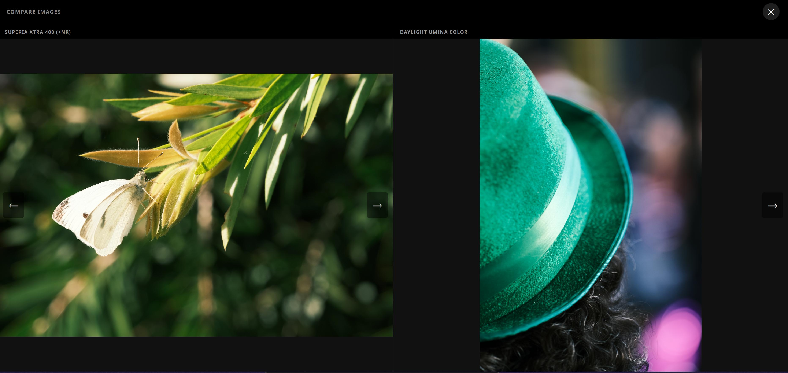

# Recipe Graphs

## Film simulation graph

In the **Recipes** section there is a **Graph** button that opens the film simulation
graph. This view shows all your recipes for a given film simulation as a connected map,
so you can see at a glance how similar or different they are from one another.

The graph picks the recipe you have shot with the most for that film simulation as the
**reference node** and places it at the centre. All other recipes radiate outward: the
further a recipe sits from the centre, the more settings it differs from the reference.
Recipes that are one or two changes away cluster close in; recipes with many differences
sit further out.

A **Film Simulation** dropdown in the corner lets you switch to a different film
simulation without leaving the page.

### Exploring a node

Clicking any node on the graph opens an info panel with details about that recipe
relative to the reference. The panel shows:

- **All differences** between the selected recipe and the reference — every setting where
  the two recipes disagree, with the value each one carries.
- **Differences broken down by path** — if the selected recipe sits further out and there
  are intermediate recipes between it and the reference, the panel breaks the changes
  down hop by hop, showing which settings shifted at each step along the route.
- **Compare images** — a side-by-side image viewer that lets you look at photos from both
  recipes at the same time, so you can judge the visual difference rather than just the
  numerical one.

  

- A link to open the **recipe graph** for the selected recipe (see below).

---

## Recipe graph

Each recipe has its own graph, accessible from the recipe detail or from the node panel
described above. It works like the film simulation graph but with three differences:

1. **The reference is fixed.** The graph is always centred on the specific recipe you
   opened it from. It does not automatically pick the most-used recipe for a film
   simulation — it uses exactly the recipe you chose.

2. **No film simulation restriction.** Related recipes can use a different film
   simulation from the reference. If you have recipes with slightly different settings
   that happen to use different film simulations, they still appear as neighbours if they
   are close enough.

3. **A maximum distance limit applies.** Only recipes within a certain number of
   differences from the reference are shown (normally 6). Recipes further away than that
   threshold are excluded, keeping the graph focused on genuinely nearby recipes rather
   than pulling in the entire collection.

Everything else works the same way: nodes radiate outward by distance, clicking a node
opens the same info panel with differences, path breakdown, image comparison, and the
option to jump to that recipe's own graph.
