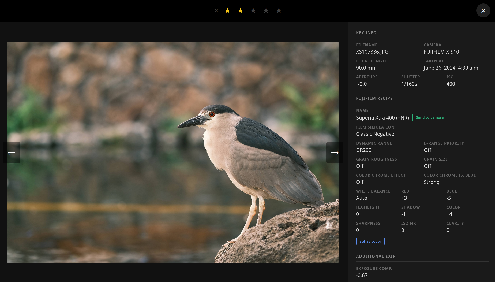
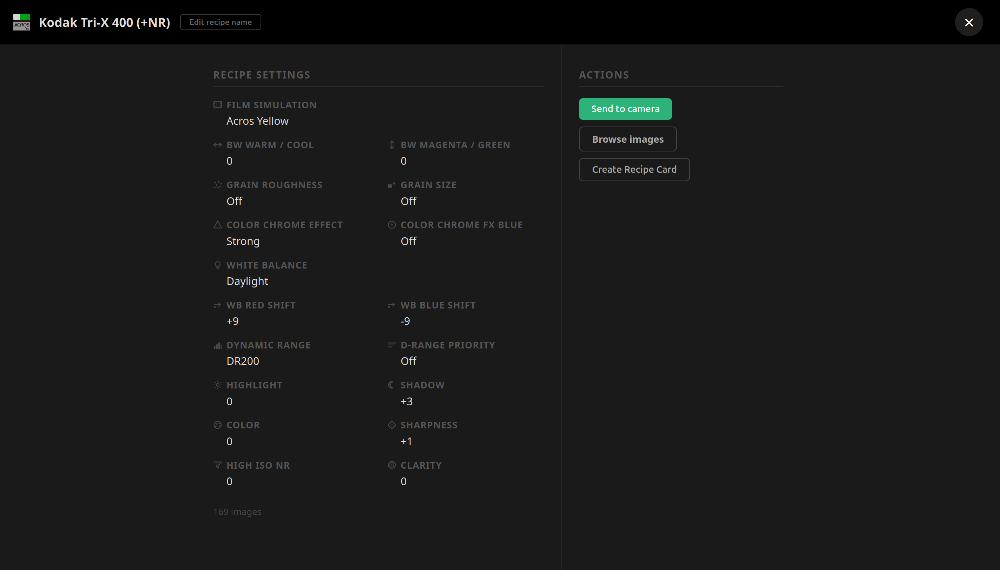

# Web Interface

## Images

### Gallery

The main gallery shows all imported images as a scrollable grid. As you scroll down, more
images load automatically.

#### Filtering

A sidebar lets you narrow the gallery by recipe settings: film simulation, dynamic range,
grain, white balance, and other creative fields. Filters update the grid without reloading
the page.

Filtering is **faceted**: selecting a value in one field instantly updates the available
choices in every other field to only show combinations that exist in your library. You can
select **multiple values within the same field** (e.g. Provia and Velvia at once) — images
matching any of those values are shown. Values that have been selected but are no longer
reachable given the other active filters are shown greyed-out; unchecking a conflicting
filter brings them back.

You can also **filter by recipe** using the searchable multi-select at the top of the
sidebar. Choosing one or more recipes narrows all other filter options to that recipe's
images, and conversely, active field filters update the recipe list to reflect only recipes
that have matching images.

A **Clear all filters** link at the top of the sidebar resets everything in one click.

You can also enable **Rating first** to sort the grid by rating (highest first), so your
best-rated images always appear at the top.

---

### Image Detail

Clicking an image opens a full-resolution detail view with all of its EXIF information,
including the complete recipe the camera had active at the time of shooting.

From the detail view you can:

- **Browse** to the previous or next image within your current filter, without going back to
  the gallery.
- **Rate the image** using the star widget (0–5). Click a star to set that rating; click the
  clear button (✕) to reset it to 0.
- **Name the recipe** — if the image's recipe has no name yet, a prompt appears inline.
  Names are limited to 25 ASCII characters, matching the camera's own slot naming rules. See
  [recipe_naming.md](recipe_naming.md) for more detail.
- **Send the recipe to your camera** — once a recipe has a name, you can write it to one of
  your camera's custom slots (C1–C7) over USB. The interface shows you what is already saved
  in each slot so you can choose where to write.
- **Set as recipe cover** — mark this image as the cover photo for its recipe, replacing
  whatever was shown before.

---

## Recipes

### Explorer

The recipes explorer lets you browse and search your entire recipe collection in one place.
You can filter by film simulation, dynamic range, grain, and other settings using the same
faceted filtering available in the image gallery.

Each recipe is shown with a cover image drawn from your library. The cover is
**customizable** — you can pick any photo associated with that recipe to represent it.

Recipes can be **imported** in two ways directly from the explorer:

- **From a Fujifilm JPEG** — the app reads the recipe embedded in the file's EXIF data.
- **From a recipe card** — upload a recipe card image (a QR code shared by another
  Fujifilm shooter) and the recipe is added to your library automatically.

---

### Recipe Detail

Opening a recipe shows all its settings at a glance. From this page you can:

- **Set the recipe name** — limited to 25 ASCII characters, matching the camera's own slot
  naming rules. See [recipe_naming.md](recipe_naming.md) for more detail.
- **Browse the recipe's images** — jump to the gallery filtered to photos shot with this
  recipe.
- **Send the recipe to your camera** — write the recipe to one of your camera's custom slots
  (C1–C7) over USB. The interface shows what is already saved in each slot so you can choose
  where to write.
- **Create a recipe card** — generate a shareable QR code card for the recipe, which other
  Fujifilm shooters can import into their own library.

---

### Graph

Each recipe has a visual graph showing how it relates to your other recipes — which ones are
close, how many settings differ between them, and how you can trace the path from one to
another. See [Recipe Graphs](recipe_graphs.md) for a full explanation of the graph views and
what you can do from them.
